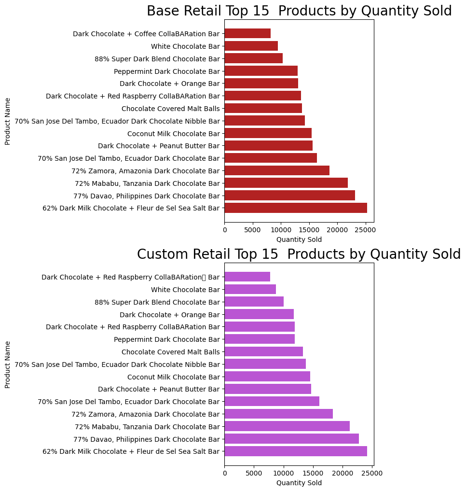
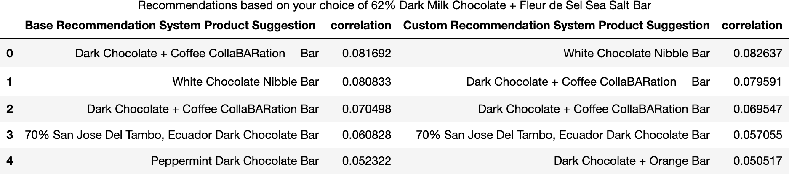
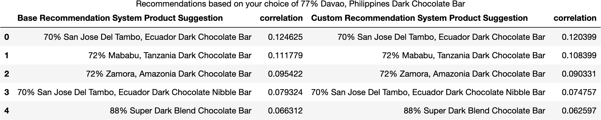
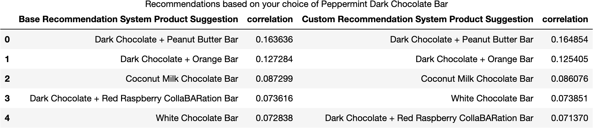
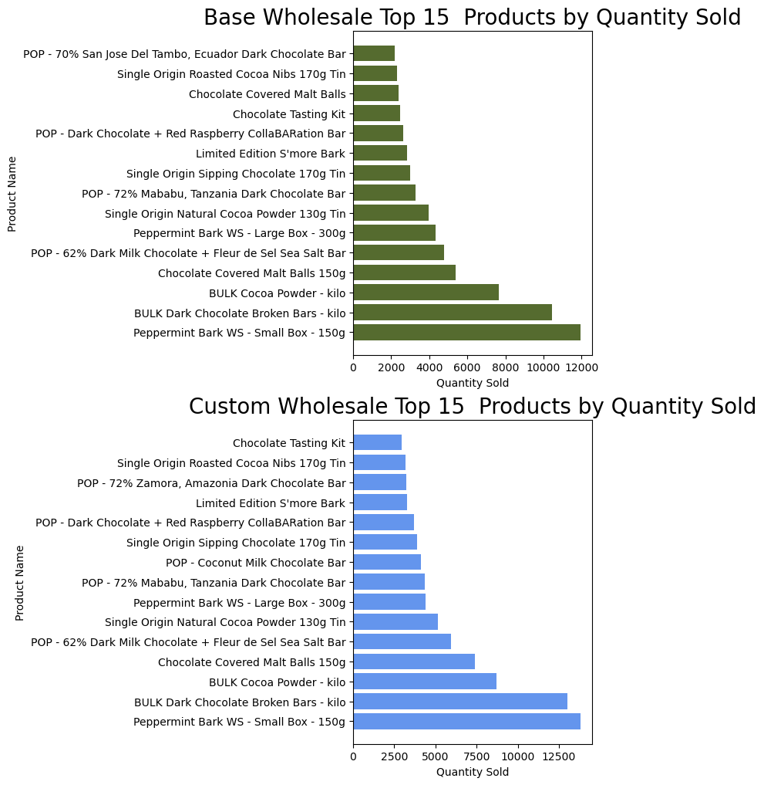
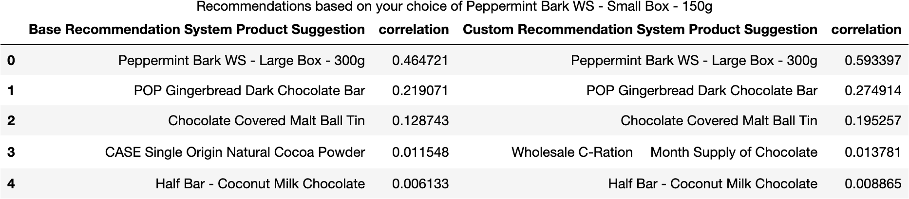
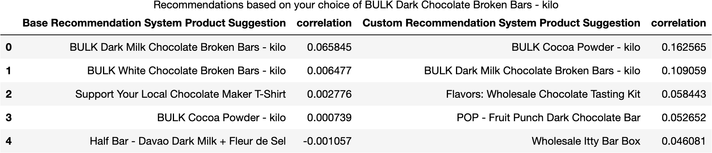
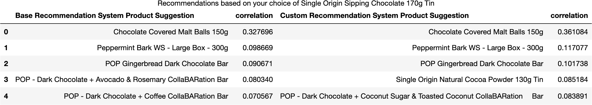

Recommender System for Askinosie Chocolate
---

## Table of Contents

- [Problem Statement](#Problem-Statement)
- [Executive Summary](#Executive-Summary)
- [Background](#Background)
- [Data Dictionary](#Data-Dictionary)
- [Analytical Summary](#Analytical-Summary)
- [Analysis and Findings](#Analysis-and-Finsdings)
- [Base Retail and Custom Retail Recommendation Systems](#Base-Retail-and-Custom-Retail-Recommendation)
- [Base Wholesale and Custom Wholesale Recommendation Systems](#Base-Wholesale-and-Custom-Wholesale-Recommendation)
- [Base and Custom Wholesale/Retail Recommendation Systems Setup Notebook](notebooks/cnn_model_to_predict_all.ipynb)
- [Conclusions and Recommendations](#Conclusion-and-Recommendations)
- [Works Cited](#Works-Cited)

---

## Problem Statement

Askinosie Chocolate is a small batch chocolate factory with an online shopping cart that serves both wholesale and retail customers. The website itself is impeccably curated, however, lacks some basic features that can increase average transactional value (ATV). In order to increase ATV on the Askinosie Chocolate website, a recommendation system will be created to promote cross-selling and up-selling for both retail and wholesale customers while they are shopping on the platform. 

---

## Executive Summary

Askinosie is a well known name in the Chocolate world. Since its creation in 2006, Askinosie chocolate has made a name for themselves by being featured in well known periodical such as Food Magazine, Embibe and even Oprah Magazine. Additionally, they have been named one of Forbes top 10 small businesses for 5 years running.

Given that such renown will invariably drive more traffic to the Askinosie Chocolate website, it is imperative that the site hosts features that will promote cross-selling and up-selling to maximize the average transactional value from every purchase made on the site.

Here, a recommendation system is described that will utilize past customer order data, collaborative filtering, to make suggestions based on the item a customer has just added to their cart. Because the recommendation system is built on past customer orders it will not only increase average transactional value but also lead to a more enriching purchase for the customer!

---

## Background

Askinosie Chocolate was founded in 2006 by Shawn Askinosie, a criminal defense lawyer turned small batch chocolate maker. At the time, artisan chocolate was not something that many people had heard of and Askinosie Chocolate became the first bean to bar chocolate makers in the United States and the first to press their own cocoa butter (one of the main ingredients in chocolate) in over 150 years([*source*](https://www.ncbi.nlm.nih.gov/pmc/articles/PMC3565969/)). The company also holds a unique business philosophy called "A Stake in the Outcome" that dictates that all individuals involved in the production of a product are entitled to a share of the profits. This means that the company practices open book management, profit shares with each farmer that works to produce the beans necessary to make the chocolate and each employee at the factory is a shareholder of the company([*source*](https://www.zingermansroadhouse.com/2018/05/why-we-love-shawn-askinosie/)). Additionally, Aksinosie Chocolate has created its own non-profit called chocolate university that is involved in community building programs both domestically and abroad that range from building computer labs and classrooms for children form the women and children shelter in their hometown of Springfield, MO to creating sustainable school lunch programs for children in the communities they source beans from in Tanzania and the Philippines([*source*](https://chocolateuniversity.org/)). 

The unusual business ethos and widespread philanthropy have garnered no shortage of media attention for the company over the years. Shawn, and his co-owner/operator/daughter Lawren Askinosie, have appeared on MSNBC, been featured in Food Magazine, Embibe, Oprah Magazine and even Forbes as one of the top ten small businesses in the united states.([*source*](https://www.jdsupra.com/legalnews/hidden-traffic-shawn-askinosie-and-the-84128/))([*source*](https://imbibemagazine.com/drink-of-the-week-askinosie-75-soconusco-sipping-chocolate/))([*source*](https://askinosie.com/blogs/the-nib/happy-holidays-2022-in-review)). Given the nationwide popularity offered by the mainstream media attention Askinosie Chocolate maintains an elegant website that is both visually attractive and easy to navigate. However, the website lacks a recommendation function that would allow for average transactional value (ATV) optimization. Recommendation systems allow for automated up-selling and cross-selling based on items that a customer places in their shopping cart([*source*](https://www.jdsupra.com/legalnews/hidden-traffic-shawn-askinosie-and-the-84128/)). In fact, a recent study by barilliance suggests that product recommendations were responsible for up to 31 percent of ecommerce revenues for the companies participating in their research([*source*](https://www.hyperon.io/blog/why-a-recommendation-engine-for-e-commerce-boosts-sales#:~:text=A%20recommender%20system%20boosts%20conversion,31%20percent%20of%20ecommerce%20revenues)). Introducing a recommendation system into Askinosie Chocolate's website would be a low cost, efficient way to improve online sales.

Collaborative filtering is a straightforward way to generate correlations necessary to build a recommendation system in the absence of product rating data([*source*](https://practicaldatascience.co.uk/data-science/how-to-create-a-simple-product-recommender-system-in-pandas)). Shopping cart data will be collected from Askinosie Chocolate's current shopping cart, Shopify, and then combined with data obtained from a backup copy of their previous website, Magento, in order to build the collaborative filtering dataset to be used to generate a recommendation system.
 
---
## Data Dictionary
*All datasets containing personal information of customers is located in a folder that is not visible on this repo*  

|Feature|Type|Dataset|Description|
|---|---|---|---|
|name|object|base_retail_no_email|Product Names|
|qty_ordered|float|base_retail_no_email|Quantity of items ordered|
|order_id|float|base_retail_no_email|Unique order ID|
|store_id|float|base_retail_no_email|ID of store, 1 for retail store or 2 for wholesale store|
|---|---|---|---|
|name|object|base_wholesale_no_email|Product Names|
|qty_ordered|float|base_wholesale_no_email|Quantity of items ordered|
|order_id|float|base_wholesale_no_email|Unique order ID|
|store_id|float|base_wholesale_no_email|ID of store, 1 for retail store or 2 for wholesale store|
|---|---|---|---|
|email_anon|float|custom_retail_email_anon|Anonymized customer email addresses |
|**product_names**|object|custom_retail_email_anon|Names of products|
|---|---|---|---|
|email_anon|float|custom_wholesale_email_anon|Anonymized customer email addresses |
|**product_names**|object|custom_wholesale_email_anon|Names of products|
|---|---|---|---|
|name|object|magento_items_base|Product Names|
|qty_ordered|float|magento_items_base|Quantity of items ordered|
|order_id|float|magento_items_base|Unique order ID|
|store_id|float|magento_items_base|ID of store, 1 for retail store or 2 for wholesale store|
|---|---|---|---|
|name|object|shopify_items_base|Product Names|
|qty_ordered|float|shopify_items_base|Quantity of items ordered|
|order_id|float|shopify_items_base|Unique order ID|
|store_id|float|shopify_items_base|ID of store, 1 for retail store or 2 for wholesale store|

---

## Analytical Summary

The objective of this project was to create a recommendation system for Askinosie Chocolate based on collaborative filtering. Two recommendation systems were created in this project, one created from raw data from the combined Magento and Shopify shopping carts and one created from cleaned and processed data from both carts. The raw data contains all order data and anonymous corresponding order numbers. Cleaned and processed data has had all orders consolidated via customer email address and email addresses were then anonymized. The hypothesis is that the cleaned and processed data that maintains customer identity and takes into consideration subsequent orders will create a stronger recommendation system based on products that customers consistently purchase with other products.

---
## Analysis and Findings

The recommendation system for raw data (base recommendation system) and cleaned and processed data (custom recommendation system) were created for both retail and customer store data. The analysis and findings of these data are described below.

## Base Retail and Custom Retail Recommendation Systems

The base retail and custom retail recommendation systems were created using the raw and cleaned and processed data, respectively. Each was used to calculate the products with the highest sales. The top 15 products in terms of sales are illustrated in figure 1 below. For the top 15 products sold, 14 of 15 were homologous in both data sets. This is most likely due to small differences in the names of products that occurred between the two different shopping carts that were not addressed in the raw dataset.    

 
*Figure 1. Base Vs Custom Retail Top Selling Products*

The recommendation systems were then used to create recommendations based on the #1 sold product, the #2 and the #10 sold product to compare the differences between the two systems. The results are summarized in the figures below.
   
 
*Figure 2. Base Vs Custom Recommendation System Results for 62% Dark Milk Chocolate with Fleur De Sel Sea Salt Bar*

Above are the correlation scores for both the custom and base recommender systems for the top selling product from both data sets. The results are a little mixed but the base system appears to perform a little better. It is also worth noting that the recommended bars are the same.

 
*Figure 3. Base Vs Custom Recommendation System Results for 77% Davao, Philippines Dark Chocolate Bar*

As before, the custom system scores a little bit worse on all except for the top recommendation. In this instance the bars are ordered the same.

 
*Figure 4. Base Vs Custom Recommendation System Results for Peppermint Dark Chocolate Bar*

This figure suggests about the same as the first. The base system performs slightly better than that custom system and the recommended items are the same but in a different order.

## Base Wholesale and Custom Wholesale Recommendation Systems

The base wholesale and custom wholesale recommendation systems the same as the retail system described above The top 15 products in terms of sales are illustrated in figure 1 below. For the top 15 products sold, 13 of 15 were homologous in both data sets. This could also be described by the minor differences in item names between the two shopping carts.

 
*Figure 5. Base Vs Custom Wholesale Top Selling Products*

The recommendation systems were then used to create recommendations based on the #1 sold product, the #2 and the #10 sold product to compare the differences between the two systems. The results are summarized in the figures below.

 
*Figure 6. Base Vs Custom Recommendation System Results for Peppermint Bark WS - Small Box - 150g Bar*

The base and custom recommendation systems for wholesale have different results for the recommendations based on the #1 selling item. Here, the custom system performs better for all recommendations and there is one item that is different between the two.

 
*Figure 7. Base Vs Custom Recommendation System Results for BULK Dark Chocolate Broken Bars - kilo*

In this recommendation there is a stark difference between the base and custom recommendations. Not only are the recommendations different for all but one but the correlation scores are much higher for the custom system. 

 
*Figure 7. Base Vs Custom Recommendation System Results for Single Origin Sipping Chocolate 170g Tin*

This figure shows that 4 of the 5 recommendations are the same between both systems and the scores for the custom system are still higher. Although, the differences are not quite as stark as the last two examples.

The notebook with the setup of both the base and custom recommender systems can be found [here](notebooks/recommendation_system.ipynb)

## Conclusions and Recommendations

The objective of this project was to create a recommendation system for Askinosie Chocolate based on collaborative filtering. The raw data base system was compared to the custom system and varying results were observed. 

For the retail customer data, the base system performed slightly better in terms of correlation. This could be described by the fact that customer purchases may be more based on purchasing items more randomly or that the purchases were based on sales offered rather than preference. Alternatively, this could also be explained by an opportunity for system optimization for the custom model. The custom system was not built on a pivot table as the base model was. This means the anonymized email address was used as an individual feature and not as an index. Using the email address in a pivot table may enhance the ability of the system to recommend products as it would have a direct line between what each customer had ordered in the past.

For the wholesale customer data the custom system performed better than the base system. This is likely due to the fact that wholesale orders are more tailored to the purchasing stores needs or previous orders. Generally speaking, the small retail shops will be more exacting in terms of what they order so that it fits in line with their clientel and fits in with the products they have ordered previously. 

For the recommender system to be implemented on the website the custom system is the system of choice. Given that it performed almost as well as the base system for orders that are historically more sporadic it suggests that it may help align customers with products that they would be ultimately more happy with and possibly promote mote orders beyond the targeted cross-selling of additional products per order. 

Likewise, the custom system performed very well on the wholesale cohort, better than the raw data system. This suggests that the custom system would be more impactful in not only cross-selling to wholesale customers but also solidifying retention as, theoretically, their sales numbers of Askinosie Chocolate products would improve as well.

## Future Work

The first next step will be to implement the recommender system on Streamlit. Most of the work has already been done, the final steps are to deploy the app.

The following step will be to optimize the custom recommender system. The system itself has much potential. Once optimized using customer email it should be far more effective in recommendations.

Lastly, a clustering model will be created as well. Most of the customer data is in a DF that is ready to cluster. Once the remaining features are processed clustering will be performed and compared against current marketing campaign customers to advise on future campaigns for the company.

---

## Works Cited

"About Askinosie" Cocoa Runners, https://cocoarunners.com/maker/askinosie/ Accessed February 28 2023

"How to create a simple product recommender system in Pandas" Practical Data Science, https://practicaldatascience.co.uk/data-science/how-to-create-a-simple-product-recommender-system-in-pandas Accessed February 28 2023

'Cross-Selling and Upselling: The Ultimate Guide', HubSpot, https://blog.hubspot.com/sales/cross-selling Accessed Accessed February 28 2023

'A PRODUCT OF CHANGE: TASTES GOOD, DOES GOOD TOO.' Askinosie Chocolate, https://askinosie.com/blogs/the-nib/a-product-of-change Accessed February 28 2023

'Why We Love Shawn Askinosie' Zingerman's Roadhouse, https://www.zingermansroadhouse.com/2018/05/why-we-love-shawn-askinosie/ Accessed February 28 2023

"Inspiring Global Kinship" Chocolate University, https://chocolateuniversity.org/ Accessed February 28 2023

"Hidden Traffic - Shawn Askinosie and the Chocolate Factory" JDSUPRA, https://www.jdsupra.com/legalnews/hidden-traffic-shawn-askinosie-and-the-84128/ Accessed February 28 2023

"Drink of the Week: Askinosie 75% Soconusco Sipping Chocolate" Imbibe, https://imbibemagazine.com/drink-of-the-week-askinosie-75-soconusco-sipping-chocolate/ 
Accessed February 28 2023

"Ecommerce Personalization Blog" Barilliance, https://www.barilliance.com/personalized-product-recommendations-stats/ Accessed February 28 2023
